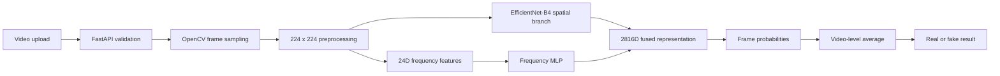

# Deepfake Video Detection

[](frontend/)
[](backend/)
[](backend/model.py)
[](https://deepfake-ten-psi.vercel.app)
[](https://deepfake-video-detection-486r.onrender.com/health)

A full-stack deepfake video detection system that combines spatial features from
EfficientNet-B4 with handcrafted frequency-domain features. The web interface
uploads a video to a FastAPI service, which samples frames, runs CPU inference,
and returns a video-level real/fake prediction with confidence scores.

## Live links

- **Frontend:** [deepfake-ten-psi.vercel.app](https://deepfake-ten-psi.vercel.app)
- **Backend health:** [deepfake-video-detection-486r.onrender.com/health](https://deepfake-video-detection-486r.onrender.com/health)
- **Interactive API docs:** [deepfake-video-detection-486r.onrender.com/docs](https://deepfake-video-detection-486r.onrender.com/docs)

> Render's free instance can sleep when idle. The first request after inactivity
> may take longer while the backend starts.

## Features

- Upload and preview MP4, MOV, WEBM, AVI, or MKV videos
- Validate extensions and reject uploads larger than 100 MB
- Sample 10 frames across each video without retaining the full video in memory
- Fall back to sequential decoding when a codec does not support random seeking
- Combine spatial and frequency-domain representations for classification
- Average frame probabilities into a video-level verdict
- Display confidence, class probabilities, frames read, and frames sampled
- Run CPU-only inference for compatibility with Render's free tier
- Serve a responsive Indigo Dashboard frontend with explicit cache controls

## System flow



## Model architecture

| Component | Implementation |
|---|---|
| Input | 10 sampled RGB frames resized to 224 x 224 |
| Spatial branch | EfficientNet-B4 feature encoder |
| Spatial representation | 1792 dimensions |
| Frequency input | 8 radial FFT bins + 16 pooled grayscale values |
| Frequency MLP | 24 -> 512 -> 1024 |
| Fusion | 1792 + 1024 = 2816 dimensions |
| Classifier | 2816 -> 1024 -> 512 -> 256 -> 2 |
| Output labels | `fake`, `real` |
| Video prediction | Mean probability across sampled frames |

## Technology stack

| Layer | Technologies |
|---|---|
| Frontend | React 19, TypeScript, Vite |
| Backend | FastAPI, Uvicorn, Python |
| Machine learning | PyTorch, Torchvision, EfficientNet-B4 |
| Video processing | OpenCV, NumPy |
| Frontend hosting | Vercel |
| Backend hosting | Render |
| Model storage | Git Large File Storage |

## Repository structure

```text
deepfake-video-detection/
|-- frontend/                   React and TypeScript web application
|   |-- src/App.tsx             Upload and prediction interface
|   |-- src/styles.css          Indigo Dashboard theme
|   `-- vercel.json             SPA routing and cache headers
|-- backend/                    FastAPI inference service
|   |-- app.py                  API routes, CORS, and upload validation
|   |-- model.py                Model architecture and video inference
|   |-- best_model.pt           Git LFS checkpoint
|   |-- requirements.txt        Pinned CPU dependencies
|   `-- render.yaml             Standalone Render configuration
|-- render.yaml                 Monorepo Render configuration
|-- vercel.json                 Monorepo Vercel configuration
`-- deepfake_video_training_kaggle.ipynb
```

## API

### `GET /health`

```json
{
  "status": "ok"
}
```

### `POST /predict`

Send a multipart form request with a video in the `file` field.

Example response:

```json
{
  "filename": "sample.mp4",
  "predicted_label": "fake",
  "confidence": 0.91,
  "probabilities": {
    "fake": 0.91,
    "real": 0.09
  },
  "frame_count": 284,
  "sampled_frames": 10
}
```

## Local development

### Prerequisites

- Python 3.11
- Node.js 20 or newer
- Git LFS

Clone the repository and download the checkpoint:

```powershell
git clone https://github.com/diyalibiswas1998/deepfake-video-detection.git
cd deepfake-video-detection
git lfs install
git lfs pull
```

### Run the backend

```powershell
cd backend
python -m venv .venv
.\.venv\Scripts\Activate.ps1
pip install -r requirements.txt
python -m uvicorn app:app --reload
```

The API is available at `http://127.0.0.1:8000`.

### Run the frontend

```powershell
cd frontend
npm install
npm run dev
```

Create `frontend/.env.local` when using a different backend:

```text
VITE_API_URL=http://127.0.0.1:8000
```

## Deployment

### Render backend variables

```text
PYTHON_VERSION=3.11.11
FRONTEND_ORIGINS=https://deepfake-ten-psi.vercel.app
TORCH_NUM_THREADS=1
INFERENCE_BATCH_SIZE=1
```

Build command:

```text
pip install -r backend/requirements.txt
```

Start command:

```text
cd backend && uvicorn app:app --host 0.0.0.0 --port $PORT
```

### Vercel frontend variable

```text
VITE_API_URL=https://deepfake-video-detection-486r.onrender.com
```

See [DEPLOYMENT.md](DEPLOYMENT.md), [BACKEND_DEPLOYMENT.md](BACKEND_DEPLOYMENT.md),
and [FRONTEND_DEPLOYMENT.md](FRONTEND_DEPLOYMENT.md) for additional details.
