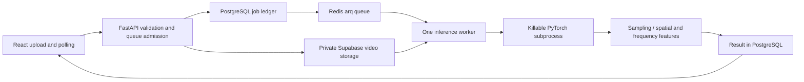
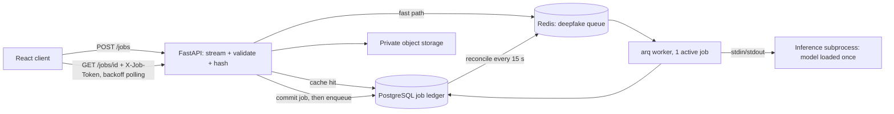

# Deepfake Video Detection

[](frontend/)
[](backend/)
[](backend/model.py)
[](https://deepfake-ten-psi.vercel.app)
[](https://deepfake-video-detection-486r.onrender.com/health)

A full-stack deepfake video detection system that combines spatial features from
EfficientNet-B4 with handcrafted frequency-domain features. The web interface
uploads a video to a FastAPI service, which persists an asynchronous job and
returns an opaque access capability immediately. A single inference worker
samples frames and produces a video-level real/fake result with confidence scores.

## Live links

- **Frontend:** [deepfake-ten-psi.vercel.app](https://deepfake-ten-psi.vercel.app)
- **Backend health:** [deepfake-video-detection-486r.onrender.com/health](https://deepfake-video-detection-486r.onrender.com/health)
- **Interactive API docs:** [deepfake-video-detection-486r.onrender.com/docs](https://deepfake-video-detection-486r.onrender.com/docs)

> Render's free instance can sleep when idle. The first request after inactivity
> may take longer while the backend starts.

## Features

- Upload and preview MP4, MOV, WEBM, AVI, or MKV videos
- Validate extensions and reject uploads larger than 100 MB
- Sample 10 frames across each video without retaining the full video in memory
- Fall back to sequential decoding when a codec does not support random seeking
- Combine spatial and frequency-domain representations for classification
- Average frame probabilities into a video-level verdict
- Display confidence, class probabilities, frames read, and frames sampled
- Run CPU-only inference for compatibility with Render's free tier
- Serve a responsive Indigo Dashboard frontend with explicit cache controls

## System flow



## Model architecture

| Component | Implementation |
|---|---|
| Input | 10 sampled RGB frames resized to 224 x 224 |
| Spatial branch | EfficientNet-B4 feature encoder |
| Spatial representation | 1792 dimensions |
| Frequency input | 8 radial FFT bins + 16 pooled grayscale values |
| Frequency MLP | 24 → 512 → 1024 |
| Fusion | 1792 + 1024 = 2816 dimensions |
| Classifier | 2816 → 1024 → 512 → 256 → 2 |
| Output labels | `fake`, `real` |
| Video prediction | Mean probability across sampled frames |

## API and failure handling

| Endpoint | Behavior |
|---|---|
| `POST /jobs` | multipart video; `202` with `job_id`, `job_token`, status, cache flag and optional completed result |
| `GET /jobs/{id}` | requires `X-Job-Token`; missing/wrong capability returns `404`; exposes queued/processing/completed/failed status |
| `POST /predict` | compatibility endpoint using the same worker; one waiter, up to 30 seconds, then `202` with job details |
| `/health` / `/ready` | liveness / PostgreSQL, Redis, storage configuration and loaded-worker readiness |
| `/metrics` | request/error/latency metrics |

PostgreSQL `deepfake_jobs` stores hashed capabilities, content/version cache keys, result/error metadata, retry schedule, worker lease and cleanup state. Indexes cover content hash, status and model/preprocessing version. Admission uses a transaction advisory lock so separate requests cannot exceed the queue bound. Redis dispatch is a fast path: reconciliation also finds committed jobs after enqueue failure or worker restart. Leases and fenced writes prevent an old worker from overwriting its successor.

The default admission ceiling is 20 outstanding jobs, one active inference, and a 300-second subprocess timeout. Saturation returns `429` with `Retry-After`. Storage/network failures retry at most three attempts with backoff; corrupt media, deterministic model errors and inference timeouts are terminal failures. Worker death kills its inference child; restart removes abandoned scratch directories. Terminal upload cleanup is retried after storage failure. Originals are removed after inference; durable results remain cached by content hash plus model/preprocessing versions.

Validation preserves the 100 MB upload ceiling, checks extension/MIME/signature, and rejects undecodable media, more than 4K pixels, 18,000 frames or 600 seconds. The existing seek-to-frame fallback and label mapping remain intact. Sampled frames are resized with the original `INTER_AREA` operation before retention: ten 4K frames require approximately 1.5 MB after resizing, instead of 249 MB. Numerical preprocessing tests verify exact equality; this is memory control, not an accuracy improvement.

## Verification and measured results

Run `cd backend && python -m pytest tests -q`. Set an explicit isolated `SDE_TEST_DATABASE_URL` ending in `_test`, the same `DATABASE_URL`, and disposable Redis to include the real ledger tests. The full locally installed runtime passes **14 tests**, including upload validation, corrupt/oversized input, capabilities, queue saturation, enqueue/restart recovery, temporary cleanup, killable timeouts, model sampling and the total-memory gate. CI uses real PostgreSQL/Redis and lightweight provider fixtures; real-model verification remains separate.

| Native Windows, sequential inference, 100 synthetic requests | Original service | Initial async worker |
|---|---:|---:|
| Warm p50 / p95 (s) | 1.626 / 1.830 | 1.247 / 1.436 |
| Completed inference/s | 0.602 | 0.782 |
| Cold model load (s) | 7.603 | 7.437 |
| Process-group RSS (MB) | 496 | 586 |
| Failures | 0 | 0 |

[Baseline](artifacts/baseline-native.json) and [worker](artifacts/upgraded-native.json) use the documented 50-video synthetic corpus. They exclude uploads, database/Redis queue wait, cache and provider wake-up. Summed native RSS can double-count shared pages and is not container memory. These earlier timings precede the final resize/cache configuration.

The adopted CPU settings are `ONEDNN_PRIMITIVE_CACHE_CAPACITY=0`, `DNNL_PRIMITIVE_CACHE_CAPACITY=0`, and `MALLOC_ARENA_MAX=2`, with one Torch thread and one-frame inference batches. [Linux PyTorch parity](artifacts/cpu-cache-parity.json) records 50/50 unchanged labels and maximum probability difference **0.0**. Original PyTorch weights, FFT features and preprocessing remain unchanged; no ONNX conversion was adopted.

| 512 MB container, 100 requests | 4 clients | 30 clients, fresh ledger |
|---|---:|---:|
| Completed jobs | 100 | 100 |
| Fresh jobs / cache hits | 52 / 48 | 63 / 37 |
| Peak total cgroup memory (MB) | 388.3 | 389.7 |
| OOM events | 0 | 0 |
| Backpressure responses, retried by clients | 0 | 224 |
| Upload acknowledgement p95 (s) | 0.096 | 2.174 |
| Fresh completion p95 incl. queue wait (s) | 11.39 | 325.11 |
| Cache-hit completion p50 (s) | 0.043 | 0.143 |

[Four-client report](artifacts/container-512m-no-primitive-cache.json), [fresh burst](artifacts/container-512m-no-primitive-cache-fresh-burst.json). The burst shared host CPU with separate numerical and Sehat experiments, so its latency is an observed constrained-host result, not a clean performance comparison. Both enforce 512 MB with no swap and include total `memory.peak`, not just anonymous RSS. The separate [cache-only burst](artifacts/container-512m-no-primitive-cache-saturation.json) had zero fresh inferences and is excluded from capacity evidence. The older default-cache configuration failed the 400 MB gate; it is retained as baseline evidence.

Host file caches were warm after building the image. A cold independent host may charge additional shared file pages to the serving cgroup. These local results qualify this configuration for live verification; they do not establish a universal memory ceiling. Observe live startup and inference memory before declaring the free deployment verified.

Reproduce with `backend/scripts/container_bench.py --image <built image> --memory 512m --requests 100 --concurrency 30 --database-url <fresh disposable *_bench database> --redis-url <disposable Redis> --output <report>`. Use a new database for an inference run; repeated workloads measure cache hits. `scripts/check_capacity.py` requires at least 100 successful requests, at least 50 fresh jobs, total peak below 400,000,000 bytes and zero OOM events. Image size is approximately 2.71 GB uncompressed. The narrow synthetic corpus does not establish a worst-case memory ceiling for every supported codec/video resolution.

Unfused float32 ONNX still failed the 0.001 parity gate: the Linux 50-input comparison reached approximately 0.00348 maximum probability difference, with unchanged labels. Those artifacts are numerical verification only. The serving runtime remains PyTorch.

| Status | Evidence |
|---|---|
| Implemented | durable jobs, private uploads, capabilities, single inference subprocess, retries/recovery/backpressure, cleanup, polling frontend, Docker/CI and metrics |
| Measured locally | 14 tests; original-model comparisons; 100-request resource runs below 400 MB; 50-video CPU-setting parity |
| Verified live | upgrade rollout pending isolated Supabase database/storage configuration and frontend connection; existing demo links do not yet prove the async upgrade |

## Technology stack

| Layer | Technologies |
|---|---|
| Frontend | React 19, TypeScript, Vite |
| Backend | FastAPI, Uvicorn, Python |
| Machine learning | PyTorch, Torchvision, EfficientNet-B4 |
| Video processing | OpenCV, NumPy |
| Frontend hosting | Vercel |
| Backend hosting | Render |
| Model storage | Git Large File Storage |

## Repository structure

```text
deepfake-video-detection/
├── frontend/                   React and TypeScript web application
│   ├── src/App.tsx             Upload and prediction interface
│   ├── src/theme.ts            Material UI theme configuration
│   └── vercel.json             SPA routing and cache headers
├── backend/                    FastAPI inference service
│   ├── app.py                  API routes, CORS, and upload validation
│   ├── model.py                Model architecture and video inference
│   ├── requirements.txt        Pinned CPU dependencies
│   └── render.yaml             Standalone Render configuration
├── best_model.pt               Git LFS checkpoint
├── render.yaml                 Monorepo Render configuration
├── vercel.json                 Monorepo Vercel configuration
└── deepfake_video_training_kaggle.ipynb
```

## Asynchronous job architecture

Inference on a 512 MB free instance is memory-bound, so request handling is separated from inference: the API accepts and persists work, and a single worker runs the model.



- **Durable ledger.** PostgreSQL owns job state. After commit the API enqueues immediately; if Redis is down, a reconcile loop re-dispatches committed jobs. Redis is disposable.
- **Bounded resources.** One active inference, a bounded queue (`MAX_QUEUED_JOBS`, default 20) with `429 Retry-After` beyond it, and the unchanged 100 MB upload ceiling.
- **Validation before expensive work.** Extension, MIME and extension/MIME agreement, container signature and streamed size are checked on upload. The inference child checks decodability, resolution (≤ 3840×2160), frame count (≤ 18,000) and duration (≤ 10 min) before sampling frames.
- **Killable inference.** The model runs in a supervised subprocess. A timeout (`INFERENCE_TIMEOUT_SECONDS`, default 300) kills the whole process and reclaims its memory; the next job starts a fresh child. On Linux the child dies with its parent.
- **Retries by failure class.** Storage/network errors (transport errors, 429, 5xx) retry at most 3 times with 5 s / 20 s backoff. Corrupt media and deterministic model errors fail once.
- **Leases.** Workers hold a 60 s lease renewed every 10 s. Expired leases are recovered, and a worker that lost its lease cannot publish results.
- **Cleanup.** Per-job scratch directories are removed after success, failure, cancellation and on worker restart. Stored originals are deleted after a terminal result, with reconciliation retrying failed deletions.
- **Result cache.** Keyed by content SHA-256 + model version + preprocessing version. Each caller still gets its own job and capability token.
- **Anonymous access control.** Each job returns an opaque `job_token`; only its SHA-256 is stored. A wrong or missing token returns 404, the same as a missing job.
- **Memory.** The model is built on PyTorch's `meta` device and adopts memory-mapped checkpoint tensors (`MODEL_LOAD_MODE=mmap`, default). Weights stay file-backed instead of occupying two anonymous heap copies. Outputs are bit-identical to the previous loader on the benchmark corpus.

The existing frame sampling, frequency features, label mapping and codec-seeking fallback are unchanged.

Sampled frames are resized with the existing `INTER_AREA` operation before retention. Ten retained 4K frames previously required 248,832,000 bytes; ten 224×224 BGR samples require 1,505,280 bytes. `backend/tests/test_model_sampling.py` verifies bit-identical preprocessing over 50 synthetic inputs, duplicate padding, capture cleanup and unseekable-codec fallback. These three runtime-dependent tests run separately with PyTorch/OpenCV installed; lightweight PR checks skip them. The full process also includes decoder/model/runtime memory, so this reduction does not establish the 400 MB deployment gate.

## API

| Route | Behavior |
|---|---|
| `POST /jobs` | multipart `file` → `202 {job_id, job_token, status, cached, result?, model_version}`; 413 over 100 MB, 415 type/MIME mismatch, 422 bad signature/empty, 429 queue full, 503 persistence unavailable |
| `GET /jobs/{id}` | header `X-Job-Token`; returns `queued / processing / completed / failed` with `result` or `error` |
| `POST /predict` | compatibility endpoint on the same bounded worker (never a second model); waits up to 30 s, then returns the `202` job |
| `GET /health` | process liveness |
| `GET /ready` | database, Redis, storage configuration and a live worker heartbeat with the model loaded; otherwise 503 |
| `GET /metrics` | request, error and latency counters; JSON logs carry request IDs |

Completed result (unchanged fields):

```json
{
  "predicted_label": "fake",
  "confidence": 0.91,
  "probabilities": {"fake": 0.91, "real": 0.09},
  "frame_count": 284,
  "sampled_frames": 10
}
```

The frontend submits to `/jobs`, polls with exponential backoff, and shows a cold-start message while a sleeping free instance wakes.

## Verification and measured results

`cd backend && python -m pytest tests -q` runs 9 tests. With `SDE_TEST_DATABASE_URL` pointing to a disposable `*_test` database and Redis, this includes real PostgreSQL/Redis scenarios:

- valid, mismatched-type, bad-signature and oversized uploads
- queue saturation (429)
- capability-token enforcement
- worker cancellation and lease recovery, plus duplicate delivery
- result cache hits
- inference timeouts that kill the child process
- a corrupt video that fails without unloading the model
- storage outage retry and backoff up to the attempt limit
- no retry for corrupt media
- scratch cleanup

**512 MB container** (`backend/scripts/container_bench.py`). This is the single supervised API+worker container, as deployed on a free web service, run under Docker Desktop (WSL2) with a hard 512 MB limit and no swap. It uses the real model and 100 submissions: 50 distinct synthetic 10-frame videos, then the same 50 again (cache hits). Synthetic media exercises serving only; it is not accuracy evidence.

| 100 jobs, 4 clients, 512 MB | Before tuning | After (mmap load + 0.5 s poll) |
|---|---:|---:|
| Completed | 100 / 100 | 100 / 100 |
| Upload acknowledgement p50 / p95 | 32 / 47 ms | 38 / 55 ms |
| Fresh job end-to-end p50 / p95 (incl. queue wait) | 29.3 / 32.4 s | **8.2 / 8.3 s** |
| Cache-hit end-to-end p50 | 26 ms | 35 ms |
| Completed jobs/s | 0.25 | **0.93** |
| Peak anonymous memory | 470 MiB | **356 MiB** |
| Cold start to `/ready` | 7.8 s | 6.3 s |
| OOM kills | 0 | 0 |

In the "before" column, the single-slot worker idled up to 5 s (arq `poll_delay`) between jobs, and the inference child held both randomly initialized and loaded weights in anonymous memory. Saturation with 30 concurrent clients (`artifacts/container-512m-saturation.json`) produced 85 `429 Retry-After` responses. All 100 jobs completed after client retries, sampled anonymous memory stayed at 353 MiB, and there were no OOM kills. Total cgroup peaks were **512 MiB** for the four-client run and **424 MiB** for saturation. Reclaimable page cache counts toward container memory. Both runs **fail the agreed peak-container-memory-below-400-MB deployment gate**; anonymous memory alone does not establish that gate. The image is 2.71 GB uncompressed.

**Native sequential inference** (Windows, same 50-video corpus, 100 requests; `backend/scripts/benchmark.py`):

| | Original in-process | Worker subprocess (mmap) |
|---|---:|---:|
| Warm p50 / p95 | 1.63 / 1.83 s | 1.24 / 1.32 s |
| Inferences/s | 0.60 | 0.80 |
| Results vs original | — | identical on all 100 |

**ONNX export** was tested and **not adopted**. The 50 frame-level labels were unchanged, but the maximum probability difference was 0.226, far above the 0.001 gate (`artifacts/onnx-verification.json`). PyTorch remains the runtime.

A second export using PyTorch 2.6.0 and ONNX Runtime 1.22.1 disabled constant folding and graph optimizations (`python backend/scripts/convert_onnx.py --unfused`). All 50 synthetic frame labels still matched, but maximum absolute probability difference was 0.00295 (`artifacts/onnx-unfused-verification.json`), above 0.001. Feeding the original Torch frequency features into this export produced the same discrepancy (`artifacts/onnx-unfused-diagnostics.json`), so changing NumPy FFT alone does not resolve it. This runtime remains unadopted. The previously measured container results above predate frame-retention resizing and are not claimed as new measurements.

The same unfused conversion was repeated in the Linux deployment image with PyTorch 2.6.0 and ONNX Runtime 1.22.1. It also failed: 50/50 labels matched but maximum absolute probability difference was 0.00348 (`artifacts/onnx-linux/onnx-unfused-verification.json`). `--output-dir` keeps platform reports separate. Neither conversion is used by the service.

## Local development

### Prerequisites

- Python 3.11
- Node.js 20 or newer
- Git LFS

Clone the repository and download the checkpoint:

```powershell
git clone https://github.com/thestonedape/deepfake-video-detection.git
cd deepfake-video-detection
git lfs install
git lfs pull
```

### Run the backend

```powershell
cd backend
python -m venv .venv
.\.venv\Scripts\Activate.ps1
pip install -r requirements.txt
python scripts/migrate.py
python scripts/supervise.py
```

Configure PostgreSQL, native Redis and private Supabase storage in `backend/.env` or exported variables. Alternatively, `docker compose up --build` from the root runs an isolated local stack; its API uses `http://127.0.0.1:8001`.

### Run the frontend

```powershell
cd frontend
npm install
npm run dev
```

Create `frontend/.env.local` when using a different backend:

```text
VITE_API_URL=http://127.0.0.1:8000
```

## Deployment

### Render backend variables

```text
PYTHON_VERSION=3.11.11
FRONTEND_ORIGINS=https://deepfake-ten-psi.vercel.app
TORCH_NUM_THREADS=1
INFERENCE_BATCH_SIZE=1
ONEDNN_PRIMITIVE_CACHE_CAPACITY=0
DNNL_PRIMITIVE_CACHE_CAPACITY=0
MALLOC_ARENA_MAX=2
```

Build command:

```text
pip install -r backend/requirements.txt
```

Start command:

```text
cd backend && python scripts/supervise.py
```

The upgraded service is configured to deploy from the root `Dockerfile`. `scripts/supervise.py` runs the API and one arq worker in one container, because the free tier has no separate worker service. It also needs `DATABASE_URL` (PostgreSQL), `REDIS_URL` (native `rediss://` TLS URL), `SUPABASE_URL`, `SUPABASE_SERVICE_ROLE_KEY` and a private `SUPABASE_VIDEO_BUCKET`. `docker compose up --build` runs PostgreSQL, Redis, migrations, API and worker locally. CI (`.github/workflows/verify.yml`) runs the tests against real PostgreSQL/Redis, builds the frontend and the Docker image, and triggers `RENDER_DEPLOY_HOOK` only on a passing `main` build. Free instances sleep: jobs survive restarts, but uninterrupted availability is not promised.

### Vercel frontend variable

```text
VITE_API_URL=https://deepfake-video-detection-486r.onrender.com
```

See [DEPLOYMENT.md](DEPLOYMENT.md), [BACKEND_DEPLOYMENT.md](BACKEND_DEPLOYMENT.md),
and [FRONTEND_DEPLOYMENT.md](FRONTEND_DEPLOYMENT.md) for additional details.
